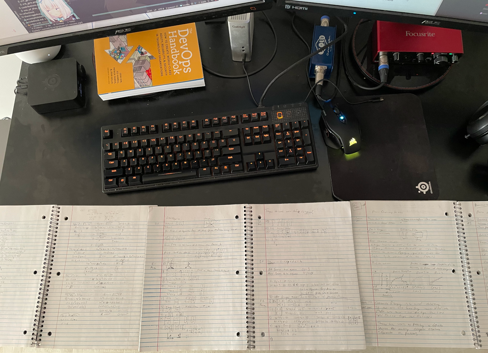

Early into my self-improvement journey, I gained the mindset of _anything is possible, if I set my sites on it_. There
is a catch though, _given enough time and effort_. Which is very important, because that is necessary for managing
expectations. Life is all about managing expectations. If the expectation was to understand Linear Algebra or Calculus,
without having a firm grasp of the prerequisites, in a short period of time. Then, I was setting myself up for heaps of
disappointment. However, if the expecting became that it would take a more than year or more of dedicated study to
accomplish that task. Then I could start to see myself actually being able to accomplish that objective. This would be
the foundation for success, because it would take a lot of time, work, and effort. However, I knew that I could do it.

# Machine Learning

There was a realization one day that I might be a bit behind the curve. This happened after watching a presentation on
what neat things can be done machine learning. At this point in time, I was also still paying attention to what folks in
the industry had to say about new developments in technology. There was this feeling that the future is moving towards
more data-centric and machine-learning provided solutions. Wanting to remain in a position where I could still make
contributions to that new future. Meant that I felt that a new skill set needed to be adopted. However, there was a deep
sinking feeling because, I knew a very heavy fact. My math skills where awful. How could I expect to make machines dance
with numbers, if I lack a strong foundation in mathematics?

I was able to skate by college and university with a shoddy foundation of math created by neglect in my early learning
days. The need for a full re-build of foundational skills, felt like a prerequisite to have any semblance of success in
these data science fields. At least, that is what I thought at the time. The only way forward, that I could see, was to
re-learn all the basics and work my way back up to a level where I could do something interesting. Essentially
instilling the confidence, that I do indeed have the strong foundational knowledge to attempt anything machine learning
related.

At the base of the mountain with really long winding road up, was where this new journey began. The measure for success
was to be able to: mostly understand, complete, and pass the exams provided by
the [MIT Linear Algebra course](https://ocw.mit.edu/courses/mathematics/18-06-linear-algebra-spring-2010/). Which would
instill the confidence needed such that, I could start taking all the [fast.ai](https://www.fast.ai/). However, in order
to reach that point, I had to completely re-build my foundational mathematical knowledge.

### Human Learning

One of the very first tasks that needed to be done was to leave my education ego at the door. Essentially fully
embracing that my foundational math skills where that of a middle-school student. Thankfully, there is an amazing
resource that was built to help children learn maths online https://www.khanacademy.org.

Here is the learning track that was followed to get to a place where I felt comfortable taking the Linear Algebra course
offered by MIT:

- Algebra I
- Geometry
- Algebra II
- Trigonometry
- Pre-Calculus
- Statistics & Probability
- Differential Calculus
- Linear Algebra

The resources provided by Khan Academy are put really well together and easy to comprehend. Performing the exercises
before being shown how to solve them really helped build my mathematical intuition. The absolute mass of content needed
to be consumed, was the most difficult part about this leg of the journey. At the time, I had 4 hours in-between
working, sleeping, and exercising, to work on whatever I wanted. Therefore, I dedicated the first two hours after waking
up, six days a week, for the next year and some to overcoming this task.

Part of this goal was to not finish as quickly as possible, the ultimate goal was to build a really strong fundamental
knowledge of math. While completing the required courses helped, understanding the content being taught was the treasure
sought. Math is a perishable skill, which meant that most of the topics being learnt would be forgotten as time went on.
Therefore, what I wanted to retain was the confidence and necessary intuitions to hash out the problems again, in the
future.

That being said, it took an immense amount of willpower to accomplish this task. What kept me going on the tough days
was the thought of not being intimated by math problems. Another trick that helps is if you ever find yourself
struggling to care mid-way through a large task, you can do the following: Step away, consume a small amount of pure
sugar (8 grams works for me), and come back to the task 3 minutes later. Our brains run on glucose, and the sugar
essentially replenish the "Give a damn" tanks in your brain. You should find that you are able to hold your focus on the
task at hand, much easier than before. This works for any difficult task and not just math problems.

The difficulty and duration of this goal also prevented me from dedicating the entirety of my free time to reaching this
goal. I wanted to remain hungry to complete the task, and still see the value in continuing. This was a monumental task
that I thought needed to be completed.

There were times that it felt like I was doing things inefficiently because of how I partitioned my effort. Like I was
moving slowly to accomplish things because, I was only doing half of the work. There was another 2 hours that were not
taking advantage of. What made things more difficult, was the same thoughts occurred with the other tasks on the other
side of the day.

I was moving slowly at accomplishing two things, because my attention was divided between both of them. However, I knew
that I am not a math focus juggernaut, and _would_ stop caring if my entire time was dedicated towards this task. So
looking back, I think that is what kept me going, because I remained hungry to complete the task.

I finally reached the milestone where I could no longer put off starting the MIT Linear Algebra course. The goal for
this course was to understand the concepts and not finish as quickly as possible. I wanted to follow the syllabus of the
course, and pretend like I needed to pass. Which would then allow me work on AI stuffs. To accomplish this, I watched
the video lectures, then read the chapters outlined, worked on the assigned homework problems, and took the tests
provided. While I am grateful these resources are provided for free, but the difficulty factor of this course was next
level. Even grading the homework proved to be difficult, and teaching assistant was not readily available to help us
out.

Thankfully, I found somebody else to work alongside me in completing the course. We spent the next 3 months (I think)
spending our free time, working the homework problems, completing exams, and studying together. We finally reached a
point where we were able to take the final exam. I distinctly remember going into that exam and treating it like it was
the real thing. The feeling of, "Yeah, I understand what is being asked here" probably made up for the past year and a
half of dedicated effort.

### Dabbling in A.I.

Once we felt like we felt like we had our fill of difficult mathematics, the next phase of education entered the
picture, machine learning. https://www.fast.ai/ is the free resource that we used as the entry point into this world of
data science. This portion of my maths journey was much easier to work on. Solving the problems in these courses
actually yielded things that were interesting. Rather than ending up with just a notebook filled with notes, I actually
had a program that did interest things.

Even better was that I felt confident going into the courses and continued to feel that way as the courses progressed. I
felt as though I understood the concepts at the core. In the end, I was able to completely go through all the material
provided by the nice folks at fast.ai. Which included building a machine learning model from scratch.

Having consumed everything that was offered from this resource and hitting a major milestone, I distinctly remember the
feeling of "Now what?" The goa,l to be able to work on machine learning problems, became actualized. I was at a
crossroads in my journey I was faced with a decision on what to do next. Having fulfilled the purpose of being able to
understand the inner workings of a complex and foreign topic, I needed to know what was next. Everything that I had been
working on had be directed towards a goal, now that I was there I did not know what to do with myself.

There where some options available to, I could continue to learn more about various machine learning and data science
topics. Various data science related challenges and programs existed, which I could participate in. However, by this
time I had convinced myself that I really did not care to get into the data science field. There were not any problems
that were fascinating enough to continue to keep my skills sharp. It might have been that I was not looking hard enough,
but there was not anything worth working towards at this point.

Late 2019, I decided that it was time for me to move onto the next interesting challenge. Looking back at things now, I
realised there was not a need to complete all the work upfront to start to dabble in machine learning. However, I am
grateful that I did, because I now have more confidence when approaching mathematical problems.

In the end, 3 notebooks filled up with the notes of my learning was not all that I was left with. I gained the assurance
of the fact that _I am_ capable of whatever I put my mind too. Even though the skills that I learn are perishable, the
intuitions that I earned can easily be re-strengthened. Who knows, maybe one day I can find an interesting problem to
work on that enables me to take advantage of these higher level maths.

Until that day comes, I have my eyes open for any new opportunity that allows me to work on a fulfilling problem.
Something that will not only benefit me, but the others that I share this world with.
