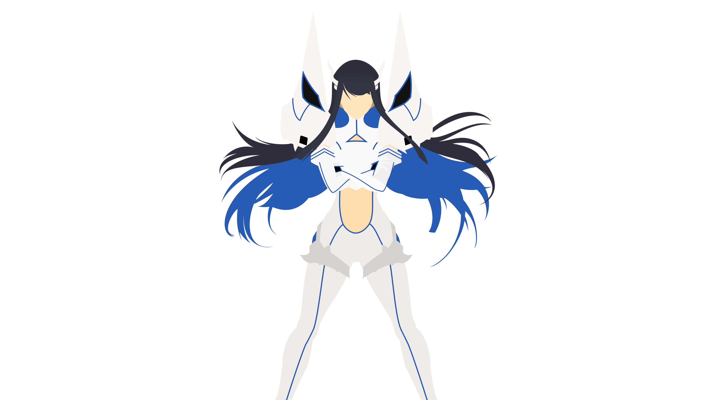
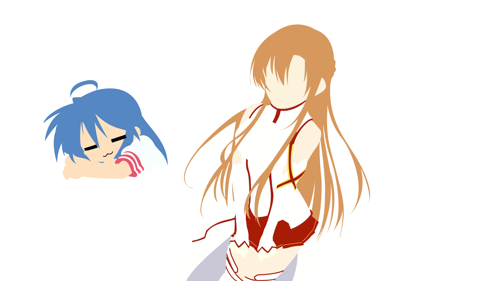
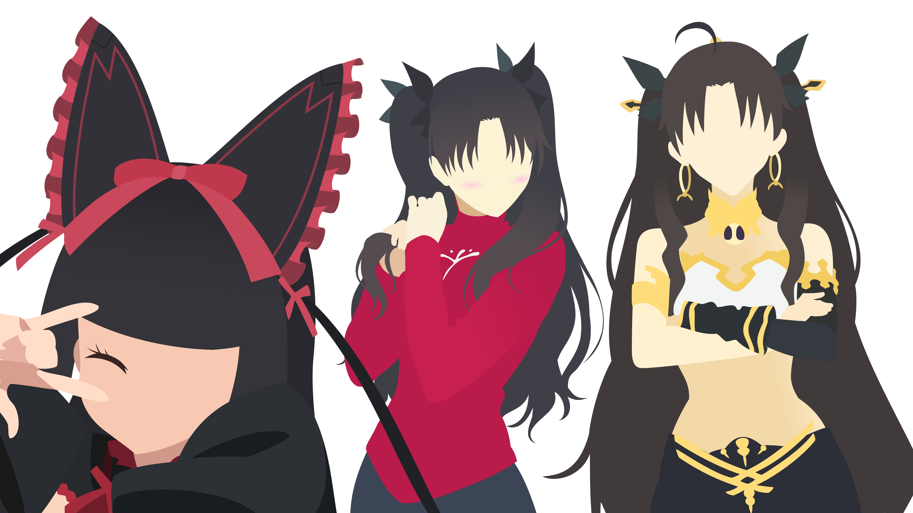
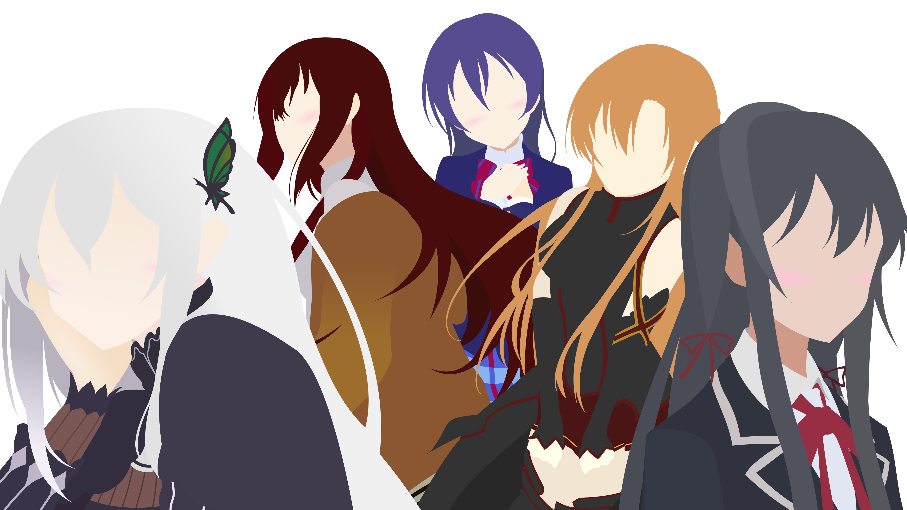
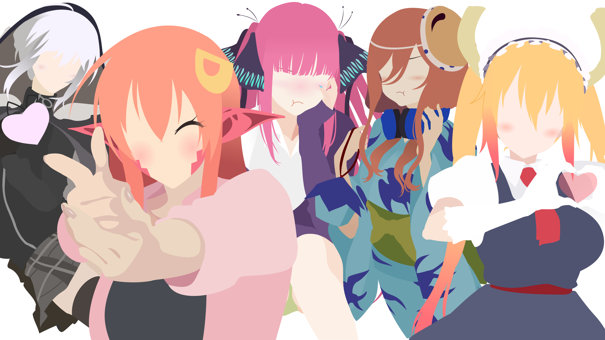
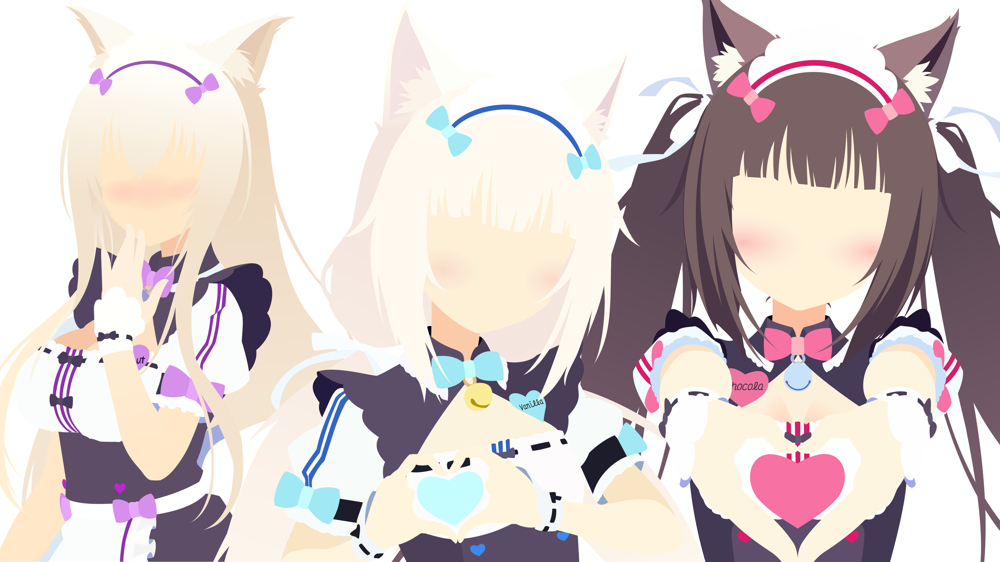

I am looking forward to the day, when somebody asks me how I primarily got my current technical skill set. The response
is not going to be something like, "Hard work and dedication", "Solving many disparate problems", or even "Reading a
bunch of other people's code". Though these are all true statements, I want to look them dead in the eyes and answer:

  
The answer (click to open)

Anything else would just be covering up this fact.

For starters, I am not the kind of person that always has the "next hot idea". I have difficulty creating from a blank
slate. Give me a problem, I will find a creative way to bridge the gap. Out of the blue, one day I thought that it would
be cool if I could write code in an editor that is themed to a specific anime girl. Since then, I have held onto this
idea with an iron grip.

Feel free to take a peek at https://doki-theme.unthrottled.io/ if you need some context.

# Right & Left Brain Problems

This is the accomplishment that gives me the most satisfaction out of everything. Not just because I can code with anime
girls now, but I also feel like I can be artistic now.

I have an extremely active and vivid visual imagination. Meaning that I solve problems by visualizing solutions in my
head. Working towards a vision is my primary form of getting things done. Take for instance, this project, the _
ultramarathon_. I know what I want to accomplish, I have vision of what its messages should relay. Now, I am working
towards that goal that I have in mind.

For clarity, when I say that I can "visualize solutions", I cannot literally _see_ the problems with my optical senses
(eg: with my eyeballs). The closest experience I can relate this to is remembering something a dream. If you can see
things in your dreams, then think back to a place you have been in a dream. It could be a building, landscape, next to a
person, scary thing, or whatever else. If you have the ability to recall or remember what anything in a dream you have
had, then that is the same "visualization" I am referring to. You probably have never seen the object with your eyes in
real life, but you still know what it looks like in your head. That is the experience I relate to when somebody else
says have a photographic memory. Not saying that I have a photographic memory, that would be nice though. No, the images
in my head are not clear enough that I can see small details, I only can only see a large vague concept. I can see the
forest, but not the trees.

Anyway, back to the topic at hand. I believe that one of the reasons that I enjoy programming so much is that there is a
creative element to it. Programming is a nice mix of finding creative solutions and solving tough logical problems. A
problem can be solved with more than one correct answer. The sky is the limit. If the solution works then, how bad can
it be? I am being facetious, there can be _terrible_ correct answers. Terrible in the fact that they are unmaintainable
or unmodifiable, and cost a lot of effort to fix. This is a can of worms that I do not feel like opening, so I will
leave it here.

Time has taught me that the mind is a muscle. It needs blood to function, runs on sugar, has the ability respond to
stimulus, needs a break, and gets stronger after recovery. These facts were immediately apparent when I started to do
more _creative_ work in programming. In this leg of my journey, I had already had a few years of hyper-focused career
study and plenty of work experience on programming problems. Meaning that I was fairly good at spending many short and
focused intervals solving these "left-brained" problems. It was not until I started expecting myself to perform the same
way with "right-brained" problems, that I found out there can be mind imbalances. Working on artistic endeavours would
drain almost every last bit of my mental energy.

Reflecting, it might just because I have gotten to the point where I did not have to think as hard to accomplish
programming problems as I did to make art. At the time it felt like I could only work artistic challenges for shorter
durations of times. While also needing a longer hiatus before starting the next artistic venture.

One of my favorite forms of creative expression is art vectorization, which is just a fancy term for, "Alex trace art
good." Vectorization is the most time-consuming and artistically challenging part of building my themes. There is a fair
amount that goes into the process:

- Decomposing the subject into layers that stack to the final product.
- Interpolating shape outlines using Bézier curves.
- Filling in missing parts character's outline, while maintaining correct perspective.
- Choosing the right colors that contrast just well enough to detect outlines.

Just converting one subject required a tremendous amount of effort. Another thing I picked up while staring at other
peoples art, at a micro detail level, is that nobody is perfect. I have learned that nobody draws in perfect Bézier
curves, and getting perspective right is also hard for other artists. They just do a better job at hiding the
inconsistencies.

If you are curious about what I am actually referring to. Feel free to take a peek at my progression of various pieces I
have completed over time.

Vectorization Progression (click to expand)

I've ordered all art vectorized by me from oldest at the top to newest at the bottom. Girls are grouped by the themed
release they appear in. I thought it might be interesting to see the progression of my style over time.

My skills have gotten to the point where creating the art necessary for each theme no longer tax me as much. Producing
each caricature also takes less time than before, probably because I avoid complicated and highly detailed art. I am at
a place where think I could produce a new batch of themes one after another. Unfortunately, I have to weigh that with
the scalability of maintaining another theme. I also want to make each theme special as well. At the time of writing
this, I have curated 61 unique colored themes (66 at the time of revision), paired with assets of the character they are
modeled after. Which is a nice segue into the next section where I talk about the technical hurdles need to be overcome
for such a ridiculous number of themes.

# Seriously?

For serious. I credit _Anime Girls_ as the reason my current skill level is as sharp as it is. College was a great
experience for me, however, the time I spent studying Computer Science pales to the shear amount of exposure of "put _
Anime Girls_ on every piece of software" has given me. In addition, a large portion of my professional career has
greatly benefited from past problems solved building out the [Doki Theme](https://github.com/doki-theme) across various
platforms.

Join me friend, as I reflect on all the problems and solutions of building tooling to support _anime girls_ on all the
important pieces of software.

### Hide-n-Seek Boss

My journey began developing the Doki Theme as
a [JetBrains product plugin](https://github.com/doki-theme/doki-theme-jetbrains). This project holds a special place in
my heart. For the first year or so, when I was building out my themes, I had no idea how to figure out how things where
styled. I also did not know that there
was [documentation on how to build a theme](https://plugins.jetbrains.com/docs/intellij/themes.html). Looking back, that
probably did not exist when I first started. I also missed out on the game
changing [UI Inspector](https://plugins.jetbrains.com/docs/intellij/internal-ui-inspector.html#enabling-the-ui-inspector)
. On top of that, I do not (and still do not) understand how Java Swing works.

Hindsight is 20-20, though I could have used those tools at the time to make my life easier. Not having them probably
gave me one of my best skills: Being able to find functionality in other people's code. If this whole programming thing
does not work out, being a detective might be a viable alternative.

[IntelliJ Idea's opensource codebase](https://github.com/JetBrains/intellij-community) is where I leveled up: being able
to find something, reading other peoples code, and guessing how things work. The code base currently consists of **
361,181** of files. If you are not aware, this presents many challenges. Most problems boil down to, "Holy Cow! There is
a lot of stuff and things work slowly." Thankfully, JetBrains has their stuff together, and made an amazing tool.
Meaning that I could use IntelliJ to browse IntelliJ's code (without wanting to die).

I have picked up various methods of where to start looking for an object of interest. Most of which are unique to my
experiences and will not probably be useful for others. That being said, it does translate well when to find a bug in
code. Bugs in code are just unknown or unexpected behaviour that potentially lives inside a codebase. The bugs that
exist outside the code are more difficult to find, but there are other tools to find those.

If I could recommend anything to bring your skills up, as a developer, this would be it. Reading other peoples code and
not being afraid to dive into foreign code. I would also highly recommend finding a massive codebase to work along-side.
Such as: [IntelliJ](https://github.com/JetBrains/intellij-community), [VSCode](https://github.com/microsoft/vscode)
, [Hyper.js](https://github.com/vercel/hyper),
and [Visual Studio](https://docs.microsoft.com/en-us/visualstudio/extensibility/visual-studio-sdk?view=vs-2019). While
those codebases are unique to my _plugin developer_ path, there are other large opensource projects that are waiting to
be explored. The real challenge is, what is the reason you are needing to read and work with these codebases? I already
have mine.

### The JVM & Black Magic

At this point in time, I feel like I know a bit too much on how Java Virtual Machine (JVM) based applications work. The
large majority of these experiences were derived from working alongside the very large JVM based application, _
IntelliJ_. Yet again, building a [JetBrains IDE plugin](https://github.com/doki-theme/doki-theme-jetbrains) has given me
valuable experience.

As I have been developing my themes, I have been trying to find unique color palettes that make pleasant themes.
Essentially pushing the boundaries of what should and should not be tolerable. Which presents its own unique set of
challenges. Mainly, what I want to make the IDE do is not what the IDE developers anticipated when building out their
look and feel. The platform belongs to them, and they can do what they like. However, hard coding colorings and not
letting things be customizable, is _frustrating_.

One of the things that bothers me a bunch is inconsistencies in styling. I want my themes to be a buttery smooth
experience, and I will not let that one gray border in the obscure window in the settings, ruin that. So I have a couple
options available to me.

- Be a good steward of opensource code, and submit a patch that allows me to customize the platform.
- Re-Write the platform's compiled code at runtime.

The latter does not require the changes to be reviewed by a maintainer, merged into the codebase, and eventually put
into a release. Using [Javassist](https://www.javassist.org/) is probably the most _lazy_ solution to a problem, but it
is the quickest! So, that is how I learned that one can literally re-write compiled library code to fix problems.
Instead of properly submitting a patch upstream.

Asides the joys of working with IntelliJ, there is another adventure I partook in that gave me more JVM knowledge.
However, I am less excited to tell this tale, because I also had to develop
an [Eclipse plugin](https://github.com/doki-theme/doki-theme-eclipse). The experience, as compared to JetBrains, was
much more dis-heartening. None of the documentation was current, up to date, or easy to find. Tutorials or examples
where ancient and not helpful. In addition, I also got to learn about [OSGi](https://en.wikipedia.org/wiki/OSGi) and
other various classloading things of Eclipse builds. I got to learn that it is very important where complied classes go
within a Java Archive (jar), and the significance of the [_
jar_ manifest file](https://docs.oracle.com/javase/tutorial/deployment/jar/downman.html). Yay, classpath issues!

### Globally Distributed Cache

There was a problem that I discovered in my early anime girl hoarding phase. That problem was, I will eventually mess up
a tiny detail in one of the assets. Once I have noticed this inconsistency, it will be the only thing that I can see
when looking at the asset. The process of fixing the issue would be:

- Correct the asset.
- Update the codebase with corrected asset.
- Re-Build Plugin.
- Submit plugin to marketplace.
- Wait 2 days for administrative approval.
- User downloads update and has to restart IDE.

Updating the asset and re-building the plugin was fine for me. However, I did not like the user experience of having to
restart on every update. Also, there was another thing that was lingering in my mind as a potential problem. At the
time, I was using assets that I found on the internet. One of the things that I wanted to avoid was a long duration
between somebody asking me to revoke the usage of an asset and when all users are no longer using the version contains
said asset.

The solution that I wanted should be able to:

- Take new updates without the user knowing.
- Be pushed new updates and have them take effect quickly.

What I settled for was Amazon's [CloudFront](https://aws.amazon.com/cloudfront/) to globally host all the assets
at https://doki.assets.unthrottled.io/. Once the plugin is downloaded and a relevant theme is set, assets will be
downloaded from the content delivery network (CDN). Once the assets have been downloaded, the next phase of asset
management begins. To detect if the asset changes, once a day, the plugin will calculate
the [MD5](https://en.wikipedia.org/wiki/MD5) of the asset locally, and compare it to the pre-calculated MD5 hash
available on the CDN. This way users are only downloading 32 bytes of information, instead of the (much larger) asset.
That fact is important, because bandwidth costs money, so fewer data sent, means lower costs! I am currently providing
my themes as a free product, so I would like to keep my expenses to a minimum. If the locally computed hash is different
from the remote hash, then the new asset is downloaded and replaced on the user's machine. That way they can still use
the plugin offline.

Here is an example of an asset and checksum combination

| Asset | Checksum |
| --- | --- |
|  | https://doki.assets.unthrottled.io/stickers/jetbrains/v2/nekoPara/cinnamon/dark/cinnamon_dark.png.checksum.txt |

Essentially, almost all the plugins that use any assets follow the aforementioned process of managing assets. Looking at
you, [GitHub themes](https://github.com/doki-theme/doki-theme-github), you non-conformist plugin and your "user safety
security pre-cautions".

I think it is really neat that there are almost 1,500 nodes of my cache that are distributed around the world and that
self-managing themselves. Providing a seamless and pleasant user experience. While giving me the peace of mind that I
can change assets if need be. Thankfully, as time has gone on, I have gotten better at building assets (meaning less
frequent changes) and most of the assets are created by me.

### Composable Build Structure

_Maintaining a large amount of themes is difficult_. As platforms evolve, so do the themes. New elements get added,
removed, deprecated, and the such. Handling these issues was not really a problem when I first started off with 4
themes. Then 4 Grew into 8, then into 14. By the time I had reached 14, it was immediately apparent that this was not a
scalable operation. It was really difficult to make updates and keep track of all the things. There were a couple of
options that I had available to me:

- Get rid of themes and only keep the important ones.
- Make it easier to maintain a large number of themes.

One is heresy and the other is a lot of work. I am up to **61** themes now, that number might be _64_ if I decide I need
a break from writing my memoir. (edit: that number is actually _66_)

So how does one make maintaining a large amount of themes easy?

- Create a
  centralized [theme definition file](https://github.com/doki-theme/doki-master-theme/blob/master/definitions/franxx/zeroTwo/dark/zero.two.dark.master.definition.json)
  which includes thing such as: a unique ID, various naming metadata, grouping information, available asset metadata,
  and color codings.
- Create
  a [composable & extendable](https://github.com/doki-theme/doki-theme-vscode/blob/master/buildSrc/assets/templates/dark.base.laf.template.json)
  template interface that can be evaluated and values provided for each theme.
- Maintain
  [application specific definitions](https://github.com/doki-theme/doki-theme-vscode/blob/master/buildSrc/assets/themes/franxx/zeroTwo/dark/zero.two.dark.vsCode.definition.json)
  that allow you to fix small one-off issues across platforms.
- Centralize and conform [the theme build process](https://github.com/doki-theme/doki-build-source).
- [Automate](https://github.com/doki-theme/doki-theme-vscode/blob/5ba0f9d3a07e19f1402b634213851d20e632cf7b/buildSrc/package.json#L33)
  , [Automate](https://github.com/doki-theme/doki-master-theme/blob/9c57f679f373703f41b2015004eb4d95a05efa21/package.json#L11)
  , [Automate](https://github.com/doki-theme/doki-theme-vscode/blob/5ba0f9d3a07e19f1402b634213851d20e632cf7b/buildSrc/src/BuildThemes.ts#L224)
  .

For the most part, this process has been scaling fairly well. It has evolved over time to remove more of the tedious
manual (but complicated) steps required to maintain the themes. Accounting for everything, when I create a batch of new
themes, it takes me now less than 30 minutes to adapt them to a supported platform. Which is a vast improvement of what
it was before.

The _only_ thing that make me hesitate to add more themes now is something I cannot (and will not) automate. Which is
changes to color palettes. Take
this [change request for example](https://github.com/doki-theme/doki-master-theme/pull/107/files), I needed to add a new
color to all of my color palettes to support usability. Being optimistic, it would take me about 5 minutes to find a
good color that works for each theme. That means it roughly required 5 hours of my time, which translates into roughly 2
days to complete, considering I have 2.5 hours a day dedicated to this project. That duration will go up every time I
need to make a change like that. Thankfully, those types of tasks seldom occur, and each time that they happen it
expands the color palette such that I can be more creative with fixes. For the most part, if there is an issue, there is
already a color available in the definition that would work well to solve the theme issue.

I am fairly confident that the issues I have just outlined are not going to prevent me from adding more themes. I will
explain my reasoning in the next section.

# The Perfect Theme

This is something that I started to look for, knowing full well that it can never be found. The best that I can do is
continue to build out my vision and continue to hoard anime girls. Further, sharpening the skill required to produce a
magnificent piece of art. For one day I am going to come across the _perfect_ anime girl, and I will be armed to the
teeth skills. Knowing that all the practice, preceding her, will have prepared me for that very moment to execute my
vision. That is my mission statement. I do not know if she exists yet or just needs to be found. Therefore, it is my
duty to continue to keep searching for _the one_. When that day comes, I know that I will be ready.

That does not mean that the other themes do not bring me joy. I have a fair number of themes that I am proud to say that
I have made. For the most part, most of my themes are special, and I would happily use them. I will be real though, I do
have my favorites.

If you asked me if I could only keep 10, I would ask you for one more and give you this list.

My Favorite Themes (Click to expand)

**Note**: These are not in any special order, just all the ones I like the most.

**Zero Two**

**Nakano Nino**

**Hanekawa Tsubasa**

**Shima Rin**

**Chocola**

**Vanilla**

**Cinnamon**

**Gray**

**Ryuko**

**Maple**

**Shigure**

I think one of the reasons that dark themes are so prevalent, is not because are light themes are awful, but because
they can be colorful. White, by definition, reflects all wavelengths of light, therefore is all colors. I re-learned
that fact, because it is hard to make any light theme _colorful_. Text is hard to read if it is not dark. Dark text
cannot be vibrant shades. However, that is not the case for dark themes, since the base lacks color. It allows for the
lexical syntax highlighting to really _pop_ against the backdrop. You might have picked up that most of my favorite
themes have either a neon blue, green, or teal. I like the contrast and have noticed that trend in my most recent
themes. It looks good in my opinion.

Another thing that I am aware of, is that I will always be subject to
the [recency bias](https://en.wikipedia.org/wiki/Recency_bias). Mostly because the more recent themes where created by
an author with more skills, than those made by distant past Alex. My skills get better over time, making the more
recent themes will be more pleasant.

I do not see myself stopping theme creation anytime soon. I normally am satisfied for about a month, then I want to get
back into the creative process again. This project has gotten to a point, where I will refuse any opportunity that will
not allow me to use any JetBrains products to develop software. However, I am doing my best to cover all of my bases.
Just wanting to avoid putting all my eggs in a single basket. Which is why I have expanded my themes
across [many platforms](https://doki-theme.unthrottled.io/products). Just in case I ever find myself in a position where
I have to use foreign tools, I still have my anime girls.

