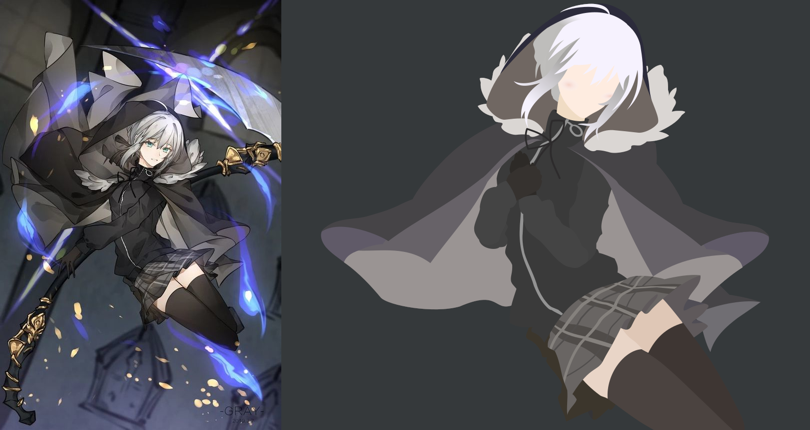

I am looking forward to the day, when somebody asks me how I got my current technical skill set. The response is not
going to be something like, "Hard work and dedication", "Solving many disparate problems", or even "Reading a bunch of
other people's code".

No, I want to look them dead in the eyes and honestly answer:

Anything else would just be covering up this fact. I attribute most of my technical prowess, because of _anime girls_.

For starters, I am not the kind of person that always has the "next hot idea". I have difficulty creating from a blank
slate. I am more of a give me a problem, I will find a way to bridge the gap. Needless to say, when I came up with the
idea, that I could write code in an editor that is themed to an anime girl. I held onto it with an iron grip.

Feel free to take a peek at https://doki-theme.unthrottled.io/ if you need some context.

# Right & Left Brain Problems

This is the accomplishment that gives me the most satisfaction out of everything.
Not just because I can code with anime girls now, but I also feel like I can make art now.

I have an extremely active and vivid visual imagination, meaning that I solve problems by visualizing solutions and problems in my head. Working towards a vision is my primary form of getting things done.
Take for instance, this project, the _ultramarathon_. I know what I want to accomplish, I have vision of what it messages should relay. Now, I am working towards that goal that I have in mind.

For clarity, when I say that I can "visualize solutions/problems", I cannot literally _see_ the problems with my optical senses. The closest related experience is if I asked you to remember a dream that you had.
If you can see things in your dreams, then think back to something you have last seen in a dream.
It could be a building, landscape, person, scary thing, or whatever else.
If you have the ability to recall or remember what anything in a dream you have had, then that is the same "visualization" I am referring to. You probably have never seen the object with your eyes in real life, but you still know what it looks like. That is the experience I relate to when somebody else says have a photographic memory. Not saying that I have a photographic memory, that would be nice though. No, the images in my head are not clear enough that I can see small details, I only have a large vague concept in my view. I can see the forest, but not the trees.

Anyways, back to the topic at hand. I believe that one of the reasons that I enjoy programming so much is that there is a creative element. Programming is a nice mix of finding creative solutions and solving tough logical problems. A problem can be solved with more than one correct answer, the sky is the limit.
If the solution works then, how bad can it be?
I being facetious, there can be _terrible_ correct answers.
Terrible in the fact that they are unmaintainable or unmodifiable.
This is a can of worms that I do not feel like opening, so I will leave it here.

Time has taught me that the mind is a muscle.
It needs blood to function, it runs on sugar, it has the ability respond to stimulus, it needs a break, and it gets stronger after recovery.
I found this out real quick when I started to do more _creative_ work in programming.

# Seriously?

For serious.

# The Perfect Theme
