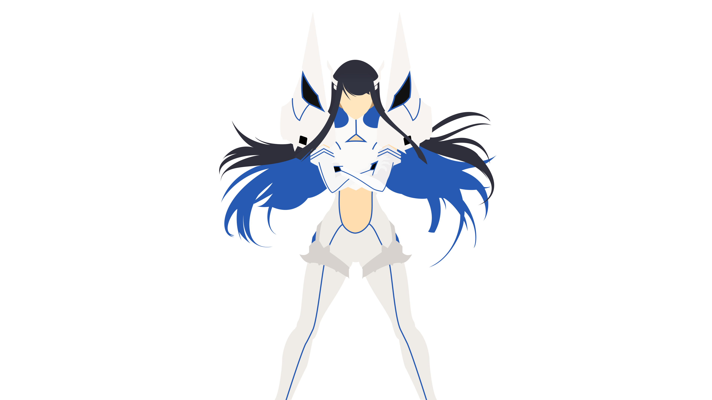
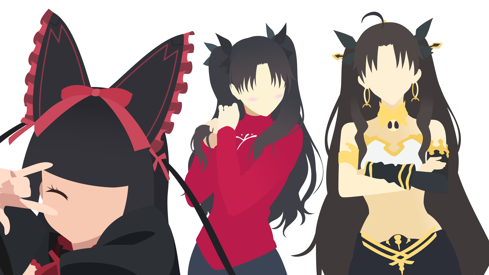
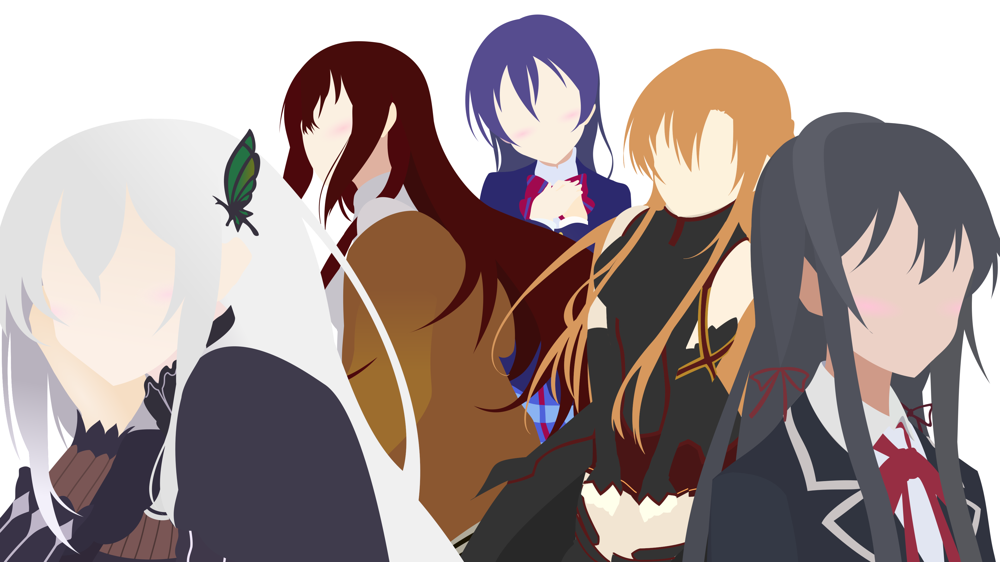
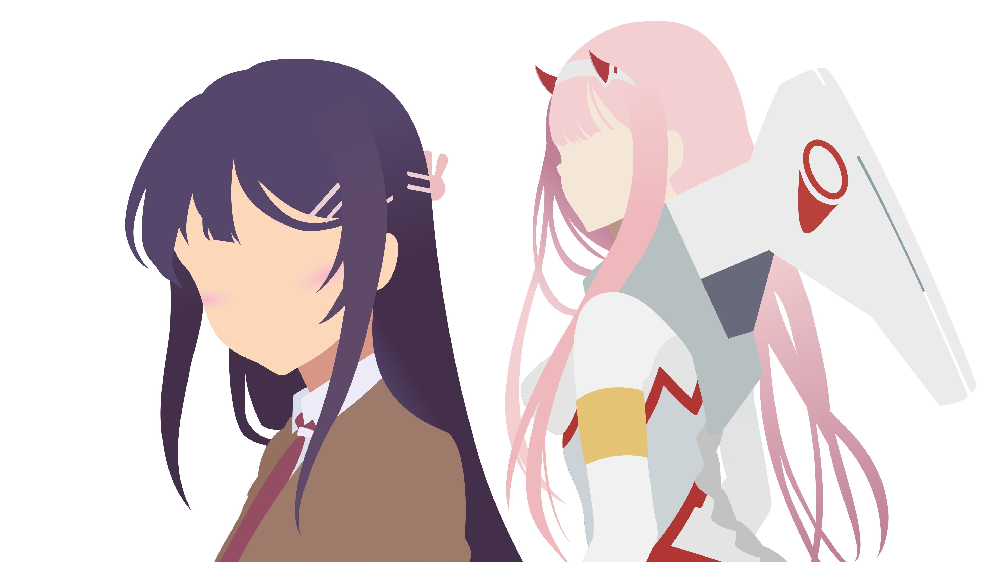
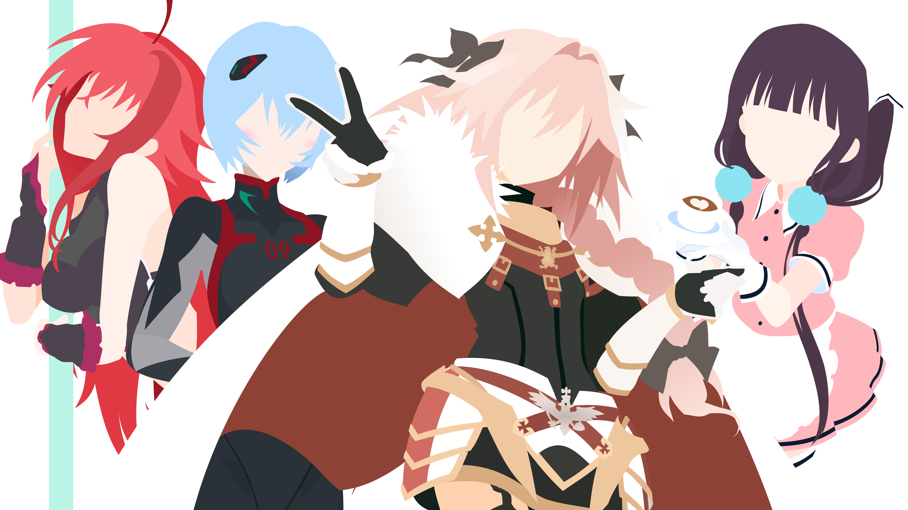
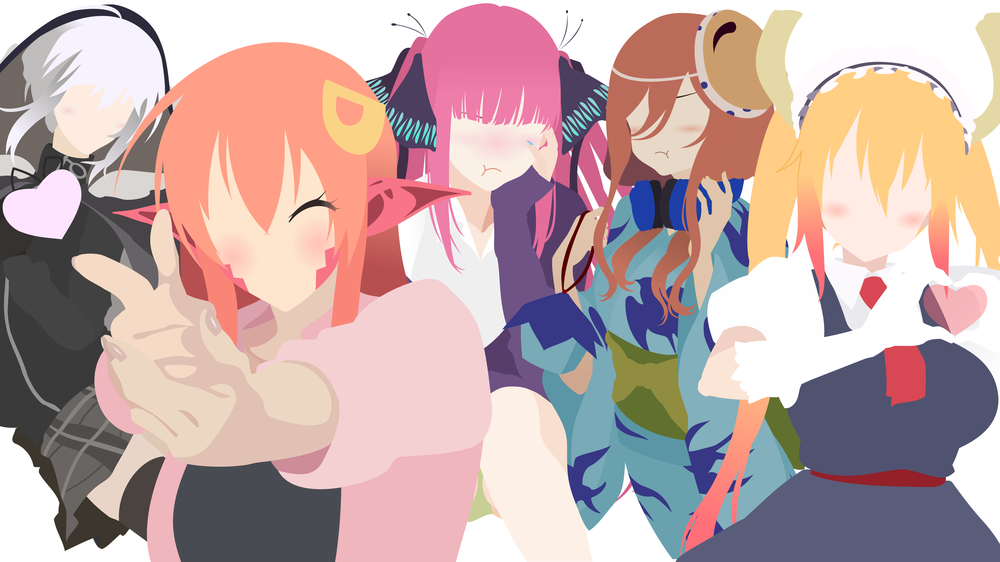

I am looking forward to the day, when somebody asks me how I got my current technical skill set. The response is not
going to be something like, "Hard work and dedication", "Solving many disparate problems", or even "Reading a bunch of
other people's code".

No, I want to look them dead in the eyes and honestly answer:

Anything else would just be covering up this fact. I attribute most of my technical prowess to _anime girls_.

For starters, I am not the kind of person that always has the "next hot idea". I have difficulty creating from a blank
slate. I am more of a give me a problem, I will find a way to bridge the gap. Needless to say, when I came up with the
idea, that I could write code in an editor that is themed to an anime girl. I held onto it with an iron grip.

Feel free to take a peek at https://doki-theme.unthrottled.io/ if you need some context.

# Right & Left Brain Problems

This is the accomplishment that gives me the most satisfaction out of everything.
Not just because I can code with anime girls now, but I also feel like I can make art now.

I have an extremely active and vivid visual imagination, meaning that I solve problems by visualizing solutions and problems in my head. Working towards a vision is my primary form of getting things done.
Take for instance, this project, the _ultramarathon_. I know what I want to accomplish, I have vision of what it messages should relay. Now, I am working towards that goal that I have in mind.

For clarity, when I say that I can "visualize solutions/problems", I cannot literally _see_ the problems with my optical senses. The closest related experience is if I asked you to remember a dream that you had.
If you can see things in your dreams, then think back to something you have last seen in a dream.
It could be a building, landscape, person, scary thing, or whatever else.
If you have the ability to recall or remember what anything in a dream you have had, then that is the same "visualization" I am referring to. You probably have never seen the object with your eyes in real life, but you still know what it looks like. That is the experience I relate to when somebody else says have a photographic memory. Not saying that I have a photographic memory, that would be nice though. No, the images in my head are not clear enough that I can see small details, I only have a large vague concept in my view. I can see the forest, but not the trees.

Anyways, back to the topic at hand. I believe that one of the reasons that I enjoy programming so much is that there is a creative element. Programming is a nice mix of finding creative solutions and solving tough logical problems. A problem can be solved with more than one correct answer, the sky is the limit.
If the solution works then, how bad can it be?
I being facetious, there can be _terrible_ correct answers.
Terrible in the fact that they are unmaintainable or unmodifiable.
This is a can of worms that I do not feel like opening, so I will leave it here.

Time has taught me that the mind is a muscle.
It needs blood to function, it runs on sugar, it has the ability respond to stimulus, it needs a break, and it gets stronger after recovery.
I found this out real quick when I started to do more _creative_ work in programming.
In this leg of my journey, I had already had a few years of hyper-focused career study and plenty of work experience on programming problems. Meaning that I was fairly good at spending many short and focused time intervals solving these "left-brained" problems.
It was not until I started expecting myself to perform with the same focus patterns and durations on "right-brained" problems, that I found out there is a difference.

Reflecting, it might just because I have gotten to the point where I did not have to think as hard to accomplish programming problems as I did to make art. At the time, it just felt like I could only work artistic challenges for shorter durations of times. In addition to needing a longer hiatus before starting the next artistic epic.

One of my favorite things is art vectorization, which is just a fancy term for, "Alex trace art good."
Vectorization is the most time-consuming and artistically challenging part of building my themes.
There is a fair amount that goes into the process:

- Decomposing the subject into layers that stack to the final product.
- Interpolating shape outlines using Bézier curves in each stack.
- Filling in gaps while maintaining perspective.
- Choosing the right colors that contrast just well enough to detect outlines.

Just converting one subject required a tremendous amount of effort.
Something I learned when staring at other peoples art at a micro-level detail, is that nobody is perfect.
I have learned that nobody draws in perfect Bezier curves, and getting perspective right is also hard for other artists. They just do a better job at hiding the inconsistencies.

Vectorization Progression (click to expand)

I've ordered all art vectorized by me from oldest at the top to newest at the bottom.
Girls are grouped by the themed release they appear in.
I thought it might be interesting to see the progression of my style over time.

My skills have gotten to the point where creating the art pieces needed for each theme no longer tax me as much.
Producing each caricature also takes less time than before, probably because I avoid complicated and highly detailed art.
It has gotten to the point, where I think I could produce a new batch of themes one after another.
Unfortunately, I have to weigh that with the scalability of maintaining another theme while keeping the existing themes special.
At the time of writing this, I have curated 61 unique color themes, paired with assets of the character they are modeled after. Which is a nice segue into the next section where I talk about the technical hurdles need to be overcome for such a ridiculous number of themes.

# Seriously?

For serious. I credit _Anime Girls_ as the reason my current skill level is as sharp as it is.
College was a great experience for me, however, the time I spent studying Computer Science pales to the shear amount of exposure of "put _Anime Girls_ on every piece of software" has given me.
In addition, a large portion of my professional career has greatly benefited from past problems solved building out the Doki Theme across various platforms.

Join me friend, as I reflect on all the problems and solutions building tooling to support _anime girls_ on all the important pieces of software.

### Hide-n-Seek Boss

My journey began developing the Doki Theme as a [JetBrains product plugin](https://github.com/doki-theme/doki-theme-jetbrains). Therefore, this project holds a special place in my heart.
For the first year or so, when I was building out my themes, I had no idea how to figure out things where styled.
I also did not know that there was [documentation on how to build a theme](https://plugins.jetbrains.com/docs/intellij/themes.html). Looking back, that probably did not exist when I first started. I also missed out, early on, on the game changing [UI Inspector](https://plugins.jetbrains.com/docs/intellij/internal-ui-inspector.html#enabling-the-ui-inspector). On top of that, I do not (and still do not) understand how Java Swing works fully.

Hindsight is 20-20, though I could have used those tools at the time, not having them gave me one of my best skills: Being able to find functionality in other people's code.
If this whole programming thing does not work out, being a detective might be an amazing alternative.

[IntelliJ Idea's opensource codebase](https://github.com/JetBrains/intellij-community) is where I leveled up my skill set in: being able to find something, reading other peoples code, and guessing how things work.
The code base currently consists of **361,181** of files.
If you are not aware, this presents many challenges. Most problems boil down to, "Holy Cow! There is a lot of stuff and things are slow." Thankfully, JetBrains has there stuff together, and made an amazing tool.
Meaning that I could use IntelliJ to browse IntelliJ's code, without wanting to die.

I have picked up various methods of where to start looking for an object of interest. Most of which are unique to my experiences and will not probably be useful for others. That being said, it does translate well when to find a bug in code. Bugs in code are just unknown or unexpected behaviour that potentially lives inside a codebase. The bugs that exist outside the code are more difficult to find, but there are other tools to find those.

If I could recommend anything to bring your skills up, as a developer, this would be it.
Reading other peoples code and not being afraid to dive into foreign code. I would also highly recommend finding a massive codebase to work along-side. Such as: [IntelliJ](https://github.com/JetBrains/intellij-community), [VSCode](https://github.com/microsoft/vscode), [Hyper.js](https://github.com/vercel/hyper), and [Visual Studio](https://docs.microsoft.com/en-us/visualstudio/extensibility/visual-studio-sdk?view=vs-2019).
While those are all unique to my `plugin developer` path, there are other large opensource projects that are waiting to be explored. The real challenge is, what is the reason you are needing to read and work with this codebase? I already have mine.

### JVM Wizardry

At this point in time, I feel like I know a bit too much about how the Java Virtual Machine (JVM) works.

As I have been developing my themes, I have been trying to find unique color palettes that make pleasant themes.
Essentially pushing the boundaries of what should and should not be tolerable.
This in turn has presented a big challenge because, what I want to do is not generally what the IDE developers anticipated.
One of the things that bothers me a bunch is inconsistencies in styling.

### Globally Distributed Cache

### Composable Build Structure

### Polyglot Problems

# The Perfect Theme
