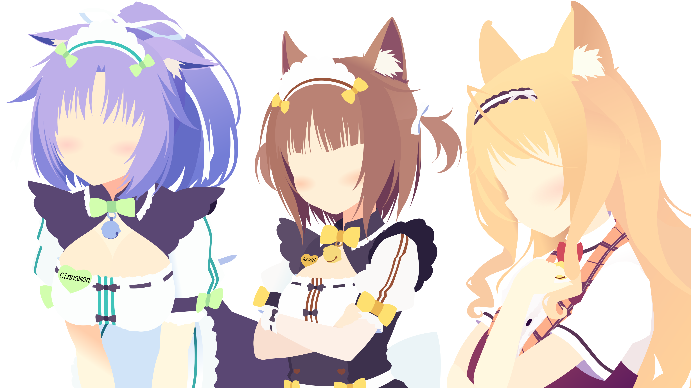

I am looking forward to the day, when somebody asks me how I got my current technical skill set. The response is not
going to be something like, "Hard work and dedication", "Solving many disparate problems", or even "Reading a bunch of
other people's code".

No, I want to look them dead in the eyes and honestly answer:

Anything else would just be covering up this fact. I attribute most of my technical prowess to _anime girls_.

For starters, I am not the kind of person that always has the "next hot idea". I have difficulty creating from a blank
slate. I am more of a give me a problem, I will find a way to bridge the gap. Needless to say, when I came up with the
idea, that I could write code in an editor that is themed to an anime girl. I held onto it with an iron grip.

Feel free to take a peek at https://doki-theme.unthrottled.io/ if you need some context.

# Right & Left Brain Problems

This is the accomplishment that gives me the most satisfaction out of everything.
Not just because I can code with anime girls now, but I also feel like I can make art now.

I have an extremely active and vivid visual imagination, meaning that I solve problems by visualizing solutions and problems in my head. Working towards a vision is my primary form of getting things done.
Take for instance, this project, the _ultramarathon_. I know what I want to accomplish, I have vision of what it messages should relay. Now, I am working towards that goal that I have in mind.

For clarity, when I say that I can "visualize solutions/problems", I cannot literally _see_ the problems with my optical senses. The closest related experience is if I asked you to remember a dream that you had.
If you can see things in your dreams, then think back to something you have last seen in a dream.
It could be a building, landscape, person, scary thing, or whatever else.
If you have the ability to recall or remember what anything in a dream you have had, then that is the same "visualization" I am referring to. You probably have never seen the object with your eyes in real life, but you still know what it looks like. That is the experience I relate to when somebody else says have a photographic memory. Not saying that I have a photographic memory, that would be nice though. No, the images in my head are not clear enough that I can see small details, I only have a large vague concept in my view. I can see the forest, but not the trees.

Anyways, back to the topic at hand. I believe that one of the reasons that I enjoy programming so much is that there is a creative element. Programming is a nice mix of finding creative solutions and solving tough logical problems. A problem can be solved with more than one correct answer, the sky is the limit.
If the solution works then, how bad can it be?
I being facetious, there can be _terrible_ correct answers.
Terrible in the fact that they are unmaintainable or unmodifiable.
This is a can of worms that I do not feel like opening, so I will leave it here.

Time has taught me that the mind is a muscle.
It needs blood to function, it runs on sugar, it has the ability respond to stimulus, it needs a break, and it gets stronger after recovery.
I found this out real quick when I started to do more _creative_ work in programming.
In this leg of my journey, I had already had a few years of hyper-focused career study and plenty of work experience on programming problems. Meaning that I was fairly good at spending many short and focused time intervals solving these "left-brained" problems.
It was not until I started expecting myself to perform with the same focus patterns and durations on "right-brained" problems, that I found out there is a difference.

Reflecting, it might just because I have gotten to the point where I did not have to think as hard to accomplish programming problems as I did to make art. At the time, it just felt like I could only work artistic challenges for shorter durations of times. In addition to needing a longer hiatus before starting the next artistic epic.

One of my favorite things is art vectorization, which is just a fancy term for, "Alex trace art good."
Vectorization is the most time-consuming and artistically challenging part of building my themes.
There is a fair amount that goes into the process:

- Decomposing the subject into layers that stack to the final product.
- Interpolating shape outlines using Bézier curves in each stack.
- Filling in gaps while maintaining perspective.
- Choosing the right colors that contrast just well enough to detect outlines.

Just converting one subject required a tremendous amount of effort.
Something I learned when staring at other peoples art at a micro-level detail, is that nobody is perfect.
I have learned that nobody draws in perfect Bézier curves, and getting perspective right is also hard for other artists. They just do a better job at hiding the inconsistencies.

Vectorization Progression (click to expand)

I've ordered all art vectorized by me from oldest at the top to newest at the bottom.
Girls are grouped by the themed release they appear in.
I thought it might be interesting to see the progression of my style over time.

My skills have gotten to the point where creating the art pieces needed for each theme no longer tax me as much.
Producing each caricature also takes less time than before, probably because I avoid complicated and highly detailed art.
It has gotten to the point, where I think I could produce a new batch of themes one after another.
Unfortunately, I have to weigh that with the scalability of maintaining another theme while keeping the existing themes special.
At the time of writing this, I have curated 61 unique color themes, paired with assets of the character they are modeled after. Which is a nice segue into the next section where I talk about the technical hurdles need to be overcome for such a ridiculous number of themes.

# Seriously?

For serious. I credit _Anime Girls_ as the reason my current skill level is as sharp as it is.
College was a great experience for me, however, the time I spent studying Computer Science pales to the shear amount of exposure of "put _Anime Girls_ on every piece of software" has given me.
In addition, a large portion of my professional career has greatly benefited from past problems solved building out the Doki Theme across various platforms.

Join me friend, as I reflect on all the problems and solutions building tooling to support _anime girls_ on all the important pieces of software.

### Hide-n-Seek Boss

My journey began developing the Doki Theme as a [JetBrains product plugin](https://github.com/doki-theme/doki-theme-jetbrains). Therefore, this project holds a special place in my heart.
For the first year or so, when I was building out my themes, I had no idea how to figure out things where styled.
I also did not know that there was [documentation on how to build a theme](https://plugins.jetbrains.com/docs/intellij/themes.html). Looking back, that probably did not exist when I first started. I also missed out, early on, on the game changing [UI Inspector](https://plugins.jetbrains.com/docs/intellij/internal-ui-inspector.html#enabling-the-ui-inspector). On top of that, I do not (and still do not) understand how Java Swing works fully.

Hindsight is 20-20, though I could have used those tools at the time, not having them gave me one of my best skills: Being able to find functionality in other people's code.
If this whole programming thing does not work out, being a detective might be an amazing alternative.

[IntelliJ Idea's opensource codebase](https://github.com/JetBrains/intellij-community) is where I leveled up my skill set in: being able to find something, reading other peoples code, and guessing how things work.
The code base currently consists of **361,181** of files.
If you are not aware, this presents many challenges. Most problems boil down to, "Holy Cow! There is a lot of stuff and things are slow." Thankfully, JetBrains has there stuff together, and made an amazing tool.
Meaning that I could use IntelliJ to browse IntelliJ's code, without wanting to die.

I have picked up various methods of where to start looking for an object of interest. Most of which are unique to my experiences and will not probably be useful for others. That being said, it does translate well when to find a bug in code. Bugs in code are just unknown or unexpected behaviour that potentially lives inside a codebase. The bugs that exist outside the code are more difficult to find, but there are other tools to find those.

If I could recommend anything to bring your skills up, as a developer, this would be it.
Reading other peoples code and not being afraid to dive into foreign code. I would also highly recommend finding a massive codebase to work along-side. Such as: [IntelliJ](https://github.com/JetBrains/intellij-community), [VSCode](https://github.com/microsoft/vscode), [Hyper.js](https://github.com/vercel/hyper), and [Visual Studio](https://docs.microsoft.com/en-us/visualstudio/extensibility/visual-studio-sdk?view=vs-2019).
While those codebases are unique to my _plugin developer_ path, there are other large opensource projects that are waiting to be explored. The real challenge is, what is the reason you are needing to read and work with this codebase? I already have mine.

### The JVM & Black Magic

At this point in time, I feel like I know a bit too much about how Java Virtual Machine (JVM) based applications work. The large majority of this experience was derived from working along side the very large JVM based application, _IntelliJ_. Yet again, building a [JetBrains IDE plugin](https://github.com/doki-theme/doki-theme-jetbrains) has given me valuable experience.

As I have been developing my themes, I have been trying to find unique color palettes that make pleasant themes. Essentially pushing the boundaries of what should and should not be tolerable.
Which presents its own unique set of challenges. Mainly, what I want to make the IDE do is not what the IDE developers anticipated when building out there look and feel. The platform belongs to them, and they can do what they like. However, hard coding colorings and not letting things be customizable is _frustrating_.

One of the things that bothers me a bunch is inconsistencies in styling.
I want my themes to be a buttery smooth experience, and I will not let that one gray border in the obscure window in the settings, ruin that. So I have a couple options available to me.

- Be a good steward of opensource code, and submit a patch that allows me to customize the platform.
- Re-Write the platform's compiled code at runtime.

The latter does not require the changes to be reviewed by a maintainer, merged into the codebase, and eventually put into a release. Using [Javassist](https://www.javassist.org/) is probably the most _lazy_ solution to a problem, but it is the quickest! So, that is how I learned that one can literally re-write a libraries code to fix problems. Instead of properly submitting a patch upstream.

Asides the joys of working with IntelliJ, there is another adventure I partook in that gave me more JVM knowledge. However, I am less excited to tell this tail, because I also had to develop an [Eclipse plugin](https://github.com/doki-theme/doki-theme-eclipse). The experience, as compared to JetBrains, was much more dis-heartening. None of the documentation was current, up to date, or easy to find. Tutorials or examples where ancient and not helpful. In addition, I also got to learn about [OSGi](https://en.wikipedia.org/wiki/OSGi) and other various classloading problem of Eclipse builds. I got to learn that it is very important where complied classes go within a Java Archive (jar), and the significance of the [_jar_ manifest file](https://docs.oracle.com/javase/tutorial/deployment/jar/downman.html). Yay, classpath issues!

### Globally Distributed Cache

There was a problem that I discovered in my early hoarding phase of anime girls.
That problem was, I will eventually mess up a tiny detail in one of the assets.
Once I have noticed this inconsistency, it will be the only thing that I can see when looking at the asset. The process of fixing the issue would be:

- Correct the asset.
- Update the codebase with corrected asset.
- Re-Build Plugin.
- Submit plugin to marketplace.
- Wait 2 days for administrative approval.
- User downloads update and has to restart IDE.

Updating the asset and re-building the plugin was fine for me.
However, I did not like the user experience of having to restart on every update.
Also, there was another thing that was lingering in my mind as a potential problem.
At the time, I was using assets that I found on the internet.
One of the things that I wanted to avoid was a long time between somebody asking me to revoke the usage of an asset and when all users are no longer using the version that uses said asset.

The solution that I wanted should be able to:

- Take new updates without the user knowing.
- Be able to push new updates and have them take effect quickly.

What I settled for was Amazon's [CloudFront](https://aws.amazon.com/cloudfront/) to globally host all the assets at https://doki.assets.unthrottled.io/. Once the plugin is downloaded and a theme is set, assets will be downloaded from the CDN. Once the assets have been downloaded, the next phase of asset management begins. To detect if the asset changes, once a day, the plugin will calculate the [MD5](https://en.wikipedia.org/wiki/MD5) of the asset locally, and compare it to the pre-calculated MD5 hash available on the CDN. This way users are only downloading 32 bytes of information, instead of the much large asset. That fact is important, because bandwidth it cost money, so fewer data set means lower costs. I am currently providing my themes as a free product, so I would like to keep my expenses to a minimum! If the locally computed hash is different from the remote hash, then the new asset is downloaded and replaced on the users machine. That way they can still use the plugin offline.

Here is an example of an asset and checksum combination

| Asset | Checksum |
| --- | --- |
|  | https://doki.assets.unthrottled.io/stickers/jetbrains/v2/nekoPara/cinnamon/dark/cinnamon_dark.png.checksum.txt |

Essentially, almost all the plugins that use any assets follow the aforementioned process of managing assets.
Looking at you, [GitHub themes](https://github.com/doki-theme/doki-theme-github), you non-conformist plugin and your "user security pre-cautions".

I think it is really neat that there are almost 1,000 nodes of my cache that are distributed around the world and that self-managing themselves. Providing a seamless and pleasant user experience. While giving me the peace of mind that I can change assets if need be. Thankfully, as time has gone on, I have gotten better at building assets and most of the assets are created by me.

### Composable Build Structure

Another nice problem that revealed itself in the beginning stages of my collection was, _maintaining themes is difficult_. As platform evolve, so do the themes. New elements get added, removed, deprecated, and the such.
Handling these issues was not really a problem when I first started off with 4 themes.
Then 4 Grew into 8, then into 14. By the time I had reached 14, it was immediately apparent that this was not a scalable operation. It was really difficult to make updates and keep track of all the things.
There were a couple of options that I had available to me:

- Get rid of themes and only keep the important ones.
- Make it easier to maintain a large number of themes.

One is heresy and the other is a lot of work. I am up to **61** themes now, that number might be _64_ if I decide I need a break from writing my memoir, you can hazard a guess which option I took.

So how does one make maintaining a large amount of themes easy?

- Create a centralized [theme definition file](https://github.com/doki-theme/doki-master-theme/blob/master/definitions/franxx/zeroTwo/dark/zero.two.dark.master.definition.json) which includes thing such as: a unique ID, various naming metadata, grouping information, available asset metadata, and color codings.
- Create a [composable & extendable](https://github.com/doki-theme/doki-theme-vscode/blob/master/buildSrc/assets/templates/dark.base.laf.template.json) template interface that can be evaluated and values provided for each theme.
- Maintain [application specific definitions](https://github.com/doki-theme/doki-theme-vscode/blob/master/buildSrc/assets/themes/franxx/zeroTwo/dark/zero.two.dark.vsCode.definition.json) that allow you to fix small one-off issues across platforms.
- Centralize [the theme build process](https://github.com/doki-theme/doki-build-source).
- Automate, Automate, Automate.

### Polyglot Problems

# The Perfect Theme
