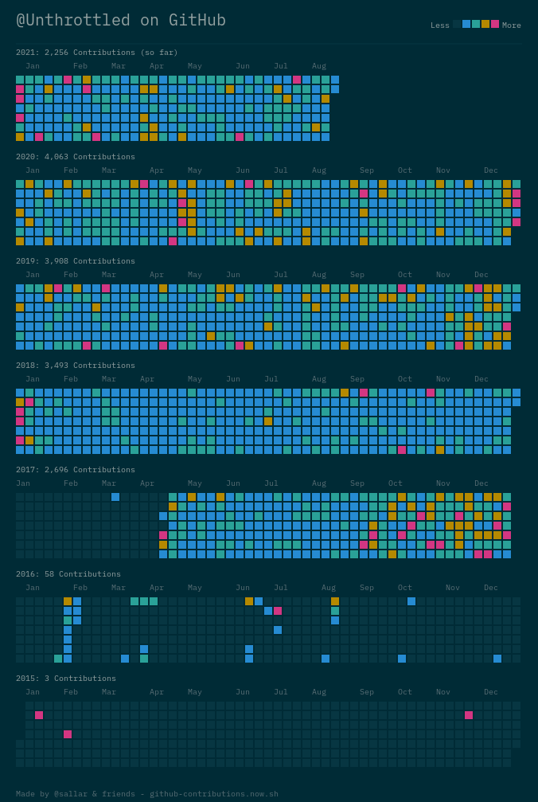

# Preface

Although I did not know it at the time, April 2017 marked the start of the next big chapter of my life.
The shear amount of stubbornness fueled the past 4 years of diligent work.
For the uninitiated the image below is going to be a large part of what is discussed in later chapters.

Since starting as a _professional_ software developer back in 2015, I have never worked a job that contributes to open source.
What you see above, is small window into the world that exists outside the 8 hours spent developing software for food.
This only really paints a vague and unclear picture of how my time was spent.

In fact, here is a list of some true statements and rhetorical questions I think you can derive _only_ from observing my contribution graph:

- "He is dedicated to working on something."
- "Doesn't he know how to give up?"
- "He probably has nothing better to do."

There are many more that willed into existence, a picture is worth a thousand words, right?
Instead of laboring on the point anymore, I want to get to the primary point of this project.

Leaving the entire story to be told only by green squares on some website, that only means things to my peers, is unacceptable.
Just moving on without saying anything, feels wrong. What I am going to do instead, is catalog all the important lessons I have learned by
shoving my face into the grindstone over the past 7 years.
This way I give myself the ability to _let go_ past habits and start a new chapter of my life. Yes, I am aware that it is the same thing as _giving up_.
However, it is wrapped in a pretty bow and easier for me to cope with. Which presents many new opportunities to find greater meaning in life.

I want to start the next chapter in my life, but first my friend, let my tell you where I have been so far.
Selfishly, I think that my full story deserves to be observed, and this is where you can view it.

# What to expect

As you might have already guessed, all of these posts are going to be really personal.
You are going to get a good idea of my personality and who I am if you choose to continue.
While I do feel a bit uneasy about sharing these, I also have to think about the other side.
Reading stories about someone's life is something I find, interesting.
Therefore, I should assume as you taking a glimpse into mine, you feel the same way.

Another hope of mine you can spend less time figuring out some lessons I learned the hard way.
That you _do not_ need to spend a ridiculous amount of time outside of work, to get better at doing _work_.
I still think that you should at least try to find your ultimate self, the peak of your performance.
While avoiding getting yourself stuck in into a time sink you have fell into a long time ago.

Also keep in mind, that most of these words are directed towards me.
This is an effort in helping me let go of something that is starting to no longer deliver expected results.
Who knows, you might also get an interesting story out of this!

# How to Consume

I am essentially writing a memoir about the past 7 years of my life.
At the time of writing this, I am not currently into sitting down and reading large blocks of text.
Therefore, I do not expect you to do the same.

I decided to break each of these posts down in such that they can be read independently of each other.
It is the combination of all these independent stories that paint the bigger picture of my journey.

Feel free to pick and choose what seems to be the most interesting.
I tried to make the titles, in the left-hand navigation bar, seem to lead to something interesting and not misleading.
